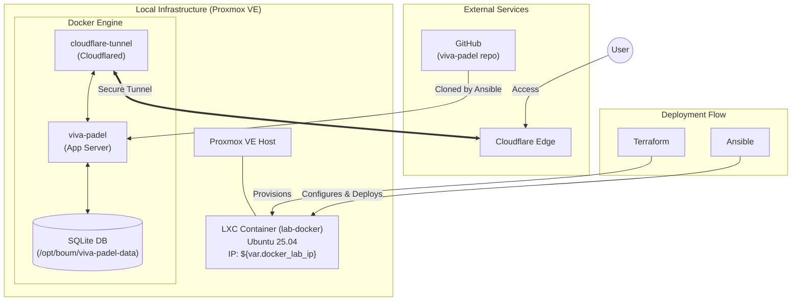

# Server Architecture Graph

This document provides a visualization and description of the server architecture deployed by the Terraform, Ansible, and Docker configurations in this repository.

## Architecture Overview

The deployment follows a layered approach:
1.  **Infrastructure (Terraform)**: Provisions an LXC container on a Proxmox VE host.
2.  **Configuration (Ansible)**: Sets up the OS, installs dependencies, clones the application, and manages secrets.
3.  **Deployment (Docker Compose)**: Runs the application and a Cloudflare tunnel for external access.

## Architecture Diagram

## Component Details

### 1. Proxmox LXC Container (`lab-docker`)
- **Provisioned by**: Terraform ([main.tf](file:///c:/Users/vuong/boum/server_deployment/homelab-iac/main.tf))
- **Specs**: 4 Cores, 4GB RAM, 200GB Storage.
- **Role**: Host for all Docker services.

### 2. viva-padel (Application)
- **Deployed by**: Ansible via Docker Compose.
- **Data Storage**: Local SQLite database mounted at `/opt/boum/viva-padel-data`.
- **Configuration**: Managed via `.env` file generated from Ansible Vault secrets.

### 3. Cloudflare Tunnel
- **Deployed by**: Ansible via [docker-compose.tunnel.yml](file:///c:/Users/vuong/boum/server_deployment/homelab-iac/docker-compose.tunnel.yml).
- **Role**: Provides secure, outbound-only access to the internal `viva-padel` service without opening firewall ports.
- **Networking**: Connected to the `viva-padel_default` Docker network.

### 4. Deployment Pipeline
- **Terraform**: Handles the "hardware" (LXC) and generates the [inventory.ini](file:///c:/Users/vuong/boum/server_deployment/homelab-iac/inventory.ini) for Ansible.
- **Ansible**: Handles the "software" (Docker, App code, Secrets) and triggers the final deployment.
